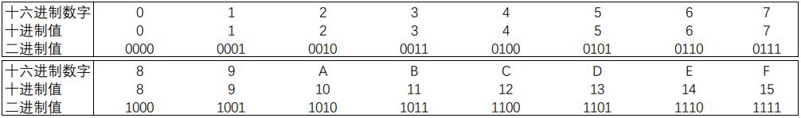

# 2.1 信息存储

大多数计算机使用**8位**的块，或者**字节(byte)**，作为最小的可寻址的内存单位，而不是访问内存中单独的位。机器级程序将内存视为一个非常大的字节数组，称为**虚拟内存(virtual memory)**,所有可能地址的集合就称为**虚拟地址空间(virtual address space)**。

## 2.1.1 十六进制表示法(hexadecimal)
### 进制对照表

  
**书本25页图2-2复刻**(没找到就自己做了一份)  

### 进制之间的转换

详细进制转换方法详见[进制转换](./conversion.md)  

## 2.1.2 字数据大小

← 上一节: <a href="./2.0信息的表示和处理.md">2.0 信息的表示和处理</a> 

