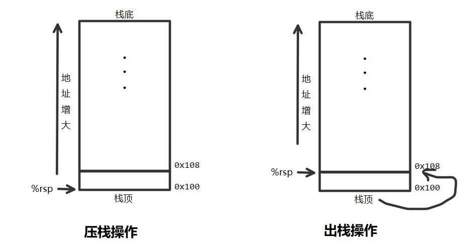

3.4.4 压入和弹出栈数据
===
push将一个数据压入栈中，首先将%rsp(栈指针)减去相应的大小(根据push操作符后缀决定),然后将值写入到新的栈顶地址。所以pushq等同于下面两条指令
```
subq $8,%rsp
moveq %rbp,(%rsp)
```
弹出一个四字的操作包括从栈顶的位置读出数据，然后将栈指针加8，所以popq %rax等价于下面两条指令
```
movq (%rsp),%rax
addq $8,%rsp
```
在x86-64中,栈向低地址方向增长,所以压栈是减小栈指针(寄存器%rsp)的值
